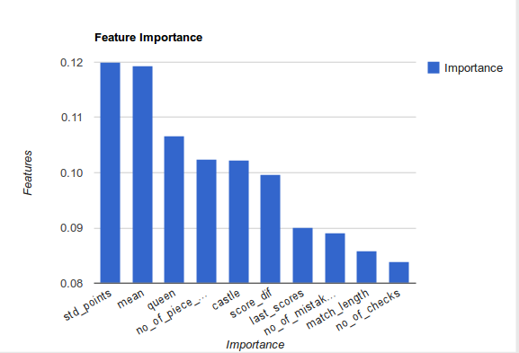

# Predicting FIDE Elo Ratings of Chess Players

A machine learning course project to solve a problem proposed by Kaggle.

[Kaggle Challenge Page](https://www.kaggle.com/c/finding-elo)

[Project Report](http://www.selcukgulcan.com/ezlinks/elo_report.pdf)

We used two predictor modeled with random forest regressor. Sum of ratings and Difference of ratings are predicted separately. Parsed features can be found in training/features and validation/features folderes.

## Feature Importance

Feature importance values for A+B predictor is shown below.

## Demonstration

Demonstration below shows how to run final predictor to create a submission file for Kaggle.

[Demo](https://asciinema.org/a/49j3c6u0milwxk42nmn2phwnq)

## Final Result

We got 204 MAE score.
